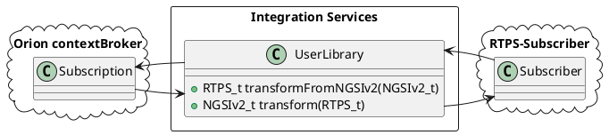

# eProsima FIROS2

*eProsima FIROS2* is an application that allows intercommunication between ROS2 and NGSIv2 protocol.
Since *FIROS2* is powered by *eProsima Integration Services* it makes possible the creation of bidirectional communication bridges with customized routing, mapping between input and output attributes or data modification between ROS2 and NGSIv2 from FIWARE-Orion contextBroker.

### Installation of FIROS2

Before using *Firos2*, it has to be installed along with the rest of *ROS2* packages of your system. If you have followed the *ROS2* installation manual provided [here](https://github.com/ros2/ros2/wiki/Installation) you only need to clone this repository on your *ROS2* workspace. For cloning this project and update its submodules at the same time, don't forget to add the *--recursive* option.. In Linux, these are the steps:

    $ cd ~/ros2_ws/src/ros2/
    $ git clone --recursive https://github.com/eProsima/firos2
    $ cd ~/ros2_ws

In the case of Windows:

    > cd C:\dev\ros2\src\ros2
    > git clone --recursive https://github.com/eProsima/firos2

On windows you must compile [*cURL Library*](https://github.com/curl/curl) that is included as thirdpary submodule:

    > cd C:\dev\ros2\src\ros2\firos2\thirdparty\curl
    > buildconf.bat
    > cd winbuild
    > nmake /f Makefile.vc mode=dll VC=14
    > cd C:\dev\ros2

Once this is done, it can be compiled like any other *ROS2* package. For example:

    $ ament build --only-package firos2

There are several examples to show the behaviour under [examples folder](https://github.com/eProsima/firos2/examples).

### FIROS2 configuration

*FIROS2* offers different parameters that can be configured. For setting-up a bridge, the user has to define a configuration file with the information about input and output protocols. A generic example can be found on [**config.xml**](https://github.com/eProsima/firos2/blob/master/resource/config.xml)

In this template is it possible to set different bridges between topics and entities. FIROS2' bridges subscribes to a topic and update data of the related entity and subscribes to entities and publish data to the related topic. The parameters that have to be defined are (only shown a *bridge* section of the *config.xml* file):

    <!-- Declares a custom bridge named 'bridge_ngsiv2' -->
    <bridge name="bridge_ngsiv2">
        <!-- Path to the NGSIv2 library -->
        <library>/path/to/ngsiv2bridge.so</library>

        <subscriber name="sub_ngsiv2">
            <property>
                <name>id</name>
                <value>entity_idPattern</value>
            </property>
            <property>
                <name>host</name>
                <value>context_broker_host</value>
            </property>
            <property>
                <name>port</name>
                <value>context_broker_port</value>
            </property>
            <property> <!-- optional -->
                <name>type</name>
                <value>entity_type</value>
            </property>
            <property> <!-- optional, comma separated values -->
                <name>attrs</name>
                <value>attr1[,attr2...]</value>
            </property>
            <property> <!-- optional -->
                <name>expression</name>
                <value>condition_expression</value>
            </property>
            <property> <!-- optional, comma separated values -->
                <name>notif</name>
                <value>notif_attr1[,notif_attr2...]</value>
            </property>
            <property>
                <name>listener_host</name>
                <value>our_listener_host</value>
            </property>
            <property>
                <name>listener_port</name>
                <value>our_listener_port</value>
            </property>
            <property>
                <!-- optional. In KB, if not specified, 2KB -->
                <name>listener_buffer_size</name>
                <value>our_listener_buffer_size</value>
            </property>
            <property> <!-- optional -->
                <name>expiration</name>
                <value>subscription_expiration_time</value>
            </property>
            <property> <!-- optional -->
                <name>throttling</name>
                <value>subscription_throttling</value>
            </property>
            <property> <!-- optional -->
                <name>description</name>
                <value>subscription_description</value>
            </property>
        </subscriber>

        <publisher name="pub_ngsiv2">
            <property>
                <name>host</name>
                <value>context_broker_host</value>
            </property>
            <property>
                <name>port</name>
                <value>context_broker_port</value>
            </property>
        </publisher>
    </bridge>

### Transformation, mapping and communication

As said before, when a bridge is connecting two nodes with different protocols, the user has to provide a library with a function to transform and/or map the attributes from one protocol to another. To make this step easier, there is an empty code template in **templatelib.cpp**.

This function will be compiled apart and loaded in *FIROS2* at runtime.

In this way, the user can map attributes from the input to the output message and at the same time to apply changes over the data. The serialization and deserialization functions are generated with provided tools, so the only thing that the user has to put are the *idl* files used in the bridge.

*FIROS2* provides a builtin *NGSIv2 bridge library* named *libisbridgengsiv2lib.so* that implements a ISBridgeNGSIv2 with NGSIv2Publisher and NGSIv2Subscriber in order to communicate RTPS and NGSIv2, implementing the interfaces ISBridge, ISPublisher and ISSubscriber respectively.

You can, of course, implement and use your own bridge libraries to define other behaviour.

You can learn more about *Bridge Libraries* and *Transformation Libraries* in the documentation of *[eProsima Integration Services](https://github.com/eProsima/Integration-Services)*.

### Types and interfaces

The interaction with the *ROS2* IDL is made from *Fast RTPS* *idl* compatible files.

For making easier the creation of types interfaces used by the communication bridges, FIROS2 includes an *idl* generator based on *rosidl_generator_dds_idl* package. *ROS2* messages definitions *msg* are slightly different from *Fast RTPS* *idl* types, but since *ROS2* is running over *Fast RTPS*, for each *msg* file exists an equivalent *idl* file.

[//]: # (Add ? .. image:: images/firos2_idl.png :align: center)

To get a deeper comprehension about the relation between *ROS2* and *Fast RTPS* IDL definitions, you can see [this article](http://design.ros2.org/articles/mapping_dds_types.html). The *FIROS2* *idl* generation feature allows two different options:

- Generate a *Fast RTPS* compatible *idl* file for an specific package. This can be achieved just adding *FIROS2* in the package CMakeLists as a dependency.

[//]: # (Add ? .. image:: images/idl_specific.png :align: center)

- Generate *Fast RTPS* compatible *idl* files by default for all the packages defined in the *ROS2* workspace. To make this possible *FIROS2* must be added to the rosidl_default_generators list.

[//]: # (Add ? .. image:: images/idl_default.png  :align: center)

The *idl* files will be created inside the workspace build directory at compilation time.

For interaction with *NGSIv2* entities an idl file (and generated files) is provided. This idl is named **JsonNGSIv2.idl** and contains a structure composed by two strings, *entityId* and *data*.

For received messages from *NGSIv2* protocol, only *data* must be filled. In this case *entityId* will be ignored, and it's better to keep it empty.
*Integration Services* will fill *data* with the complete Json string sent to our listener by the contextBroker server (this is, the subscription result).

For send messages to the contextBroker to update entities from changes received from *RTPS* subscriber, *JsonNGSIv2" must fill *entityId* with the entityId of the entity modified and *data* with a composed Json containing the attributed to be updated.

The interaction with the *NGSIv2* entities must be implemented by the user in the transformation library.

In the example **TIS_NGSIv2** the tranformation library shown examples of both transformations using the described behaviour.

## Dynamic Types

As example of integration with **Dynamic Types**, Dyn_TIS_NGSIv2 example have been added.
RobotExample executable uses static types (to show compatibility), but ROS2 publisher/subscriber uses DynamicTypes, as
well as NGSIv2 that uses a dynamic version of the NGSIv2 JSON library.
All Dynamic Types related files are under *DynNGSIv2* folder, that generates an aditional dynamic library to be used with dynamic types transformation libraries.