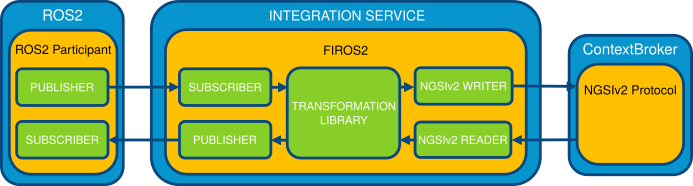

# eProsima FIROS2


*eProsima FIROS2* is an application that allows intercommunication between *ROS2* and *NGSIv2* protocol.
Since *FIROS2* is powered by *eProsima Integration Service*, it makes possible the creation of bidirectional
communication bridges with customized routing, to map between input and output attributes, and perform data
modification between *ROS2* and *NGSIv2* from *FIWARE-Orion contextBroker*.

<p align="center">  </p>

<hr></hr>

### **Table Of Contents**

[Installation](#installation-of-firos2)

[Configuration](#firos2-configuration)

[Transformation, mapping and communication](#transformation-mapping-and-communication)

[Types and interfaces](#types-and-interfaces)

[Dynamic Types](#dynamic-types)

<hr></hr>

### Installation of FIROS2

Before using *FIROS2*, it has to be installed along with the rest of *ROS2 Crystal* packages of your system.
If you have followed the *ROS2*
<a href="https://index.ros.org/doc/ros2/Installation" target="_blank">installation manual</a>,
you only need to clone this repository on your *ROS2* workspace.

`NOTE: Only ROS2 Crystal is currently supported by FIROS2.`

For cloning this project and update its submodules at the same time, don't forget to add the *--recursive* option.

In Linux, these are the steps:

``` bash
    $ cd ~/ros2_ws/src/ros2/
    $ git clone --recursive https://github.com/eProsima/firos2
    $ cd ~/ros2_ws
```

In the case of Windows:

``` bash
    > cd C:\dev\ros2\src\ros2
    > git clone --recursive https://github.com/eProsima/firos2
```

On windows you must compile [*cURL Library*](https://github.com/curl/curl) as a thirdpary submodule:

``` bash
    > cd C:\dev\ros2\src\ros2\firos2\thirdparty\curl
    > buildconf.bat
    > cd winbuild
    > nmake /f Makefile.vc mode=dll VC=14
    > cd C:\dev\ros2
```

Once done, *FIROS2* is compiled like any other *ROS2* package.

For example:

``` bash
    $ colcon build --cmake-args -DTHIRDPARTY=ON --packages-select firos
```

There are several examples to show the behavior under the [examples folder](examples).

### FIROS2 configuration

*FIROS2* offers different parameters that the user can configure. For setting-up a *bridge*,
the user has to define a configuration file with the information about input and output protocols.
There is a generic example on [**config.xml**](resource/config.xml)

In this template is it possible to set different bridges between topics and entities.
*FIROS2's* *bridges* subscribe to a topic and update data of the related entity and subscribe to entities and
publish data to the related topic.
The parameters that have to be defined are (only shown a *bridge* section of the *config.xml* file):

    <!-- Declares a custom bridge named 'bridge_ngsiv2' -->
    <bridge name="bridge_ngsiv2">
        <!-- Path to the NGSIv2 library -->
        <library>/path/to/ngsiv2bridge.so</library>

        <reader name="sub_ngsiv2">
            <property>
                <name>id</name>
                <value>entity_idPattern</value>
            </property>
            <property>
                <name>host</name>
                <value>context_broker_host</value>
            </property>
            <property>
                <name>port</name>
                <value>context_broker_port</value>
            </property>
            <property> <!-- optional -->
                <name>type</name>
                <value>entity_type</value>
            </property>
            <property> <!-- optional, comma separated values -->
                <name>attrs</name>
                <value>attr1[,attr2...]</value>
            </property>
            <property> <!-- optional -->
                <name>expression</name>
                <value>condition_expression</value>
            </property>
            <property> <!-- optional, comma separated values -->
                <name>notif</name>
                <value>notif_attr1[,notif_attr2...]</value>
            </property>
            <property>
                <name>listener_host</name>
                <value>our_listener_host</value>
            </property>
            <property>
                <name>listener_port</name>
                <value>our_listener_port</value>
            </property>
            <property>
                <!-- optional. In KB, if not specified, 2KB -->
                <name>listener_buffer_size</name>
                <value>our_listener_buffer_size</value>
            </property>
            <property> <!-- optional -->
                <name>expiration</name>
                <value>subscription_expiration_time</value>
            </property>
            <property> <!-- optional -->
                <name>throttling</name>
                <value>subscription_throttling</value>
            </property>
            <property> <!-- optional -->
                <name>description</name>
                <value>subscription_description</value>
            </property>
        </reader>

        <writer name="pub_ngsiv2">
            <property>
                <name>host</name>
                <value>context_broker_host</value>
            </property>
            <property>
                <name>port</name>
                <value>context_broker_port</value>
            </property>
        </writer>
    </bridge>

### Transformation, mapping and communication

As said before, when a *bridge* is connecting two nodes with different protocols,
the user has to provide a library with a function to transform and to map the attributes from one protocol to another.
To make this step easier, there is an empty code template in **templatelib.cpp**.

This function will be compiled apart and loaded in *FIROS2* at runtime.

In this way, the user can map attributes from the input to the output message and at the same time apply changes
over the data. The serialization and deserialization functions are generated with provided tools,
so the *IDL* files used are the only thing that the user has to put in the bridge.

*FIROS2* provides a built-in *NGSIv2 bridge library* named *libisbridgengsiv2lib.so* that implements an
*ISBridgeNGSIv2* with *NGSIv2Publisher* and *NGSIv2Subscriber* that allows communicating RTPS and NGSIv2,
implementing the interfaces *ISBridge*, *ISWriter*, and *ISReader* respectively.

You can, of course, implement and use your *bridge libraries* to define other behaviors.

You can learn more about *Bridge Libraries* and *Transformation Libraries* in the documentation of
*[eProsima Integration Service](https://integration-services.readthedocs.io/)*.

### Types and interfaces

For interaction with *NGSIv2* entities exists an *IDL* file (and generated files).
This *IDL* is named **JsonNGSIv2.idl** and contains a structure composed of two strings, *entityId*, and *data*.

On receiving messages from *NGSIv2* protocol, it only fills the *data* field.
In this case, it ignores the *entityId* field, and it's better to keep it empty.
*Integration Service* will fill *data* with the complete JSON string sent to our listener by the
*contextBroker* server (this is, the subscription result).

For sending messages to the *contextBroker* to update entities from changes received from *RTPS* subscriber,
*JsonNGSIv2" must fill *entityId* with the *entityId* of the entity modified and *data* with a composed JSON
containing the attributed to being updated.

The user must implement the interaction with the *NGSIv2* entities in the *transformation library*.

In the example **TIS_NGSIv2** the *transformation library* shows examples of both transformations using the
described behavior.

You can create your *IDL* files to define the required behavior and management of the data.
To get a deeper comprehension of the relation between *ROS2* and *Fast RTPS* IDL definitions,
you can see [this article](http://design.ros2.org/articles/mapping_dds_types.html).

## Dynamic Types

An example of integration with **Dynamic Types** can be found in the *Dyn_TIS_NGSIv2* example.
*RobotExample* executable uses static types (to show compatibility),
but *ROS2* publisher/subscriber uses *DynamicTypes*, as well as *NGSIv2* that uses a dynamic version of the
*NGSIv2 JSON* library.
All *Dynamic Types* related files are under *DynNGSIv2* folder,
that generates an additional dynamic library to be used with *dynamic types transformation libraries*.
