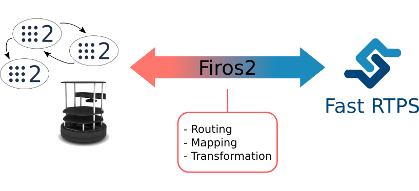

eProsima Firos2
===============

*eProsima Firos2* is a *ROS2* integrable tool focused in the intercommunication between *ROS2* and FIWARE through *Fast RTPS* Generic Enabler.

Since *Firos2* is powered by the *eProsima Protocol Bridging Service*, and it makes possible the creation of communication bridges with customized routing, mapping between input and output attributes or data modification.

Installation in a ROS2 workspace
--------------------------------

Before using *Firos2*, it has to be installed along with the rest of *ROS2* packages of your system. If you have followed the *ROS2* installation manual provided `here <https://github.com/ros2/ros2/wiki/Installation>`_ you only need to clone this repository on your *ROS2* workspace. For cloning this project and update its submodules at the same time, don't forget to add the *--recursive* option.. In Linux, these are the steps:

.. code-block:: shell

    $ cd ~/ros2_ws/src/ros2/
    $ git clone --recursive https://github.com/eProsima/firos2

In the case of Windows:

.. code-block:: shell

    > cd C:\\dev\ros2\src\ros2
    > git clone --recursive https://github.com/eProsima/firos2

Once this is done, it can be compiled like any other *ROS2* package. For example:

.. code-block:: shell

    $ ament build --only-package firos2

Information about how to set-up a bridge and the steps that have to be followed by the user can be found in the `doc <doc>`_ directory. Additionaly, in the `examples <examples/helloworld>`_ directory is presented a step by step working example of a *Firos2* bridge communicating the hello world programs provided by *ROS2* and *Fast RTPS*.
