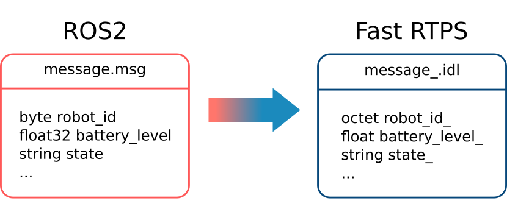
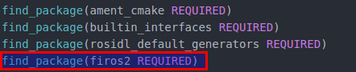
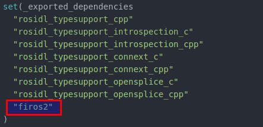

Firos2 configuration
====================

*Firos2* offers different parameters that can be configured. For setting-up a bridge, the user has to define a basic configuration file with the information about input and output topics. A generic template can be found on `config.xml <resource/config.xml>`_

In this template is it possible to set different bridges between pairs of topics. Firos2 bridges subscribes to a topic and publish data to another topic. The parameters that have to be defined are:

*   **subscriber**

    *   participant: the name of the subscriber participant.
    *   domain: ID of the domain from data is received.
    -   topic: the specific topic to be subscripted.
    -   type: the name of the type to be received.

-   **publisher**

    -   participant: the name of the publisher participant.
    -   domain: ID of the domain where data is published.
    -   topic: the specific topic to publish on.
    -   type: the name of the type to be published.

-   **transformation**: the file path with the transformation functions binary.

Transformation and mapping
--------------------------

As said before, when a bridge is connecting two topics with different types, the user has to provide a function to transform and/or map the attributes from one type to another. To make this step easier, there is an empty code template in `templatelib.cpp <resource/templatelib.cpp>`_.

In this way, the user can map attributes from the input to the output message and at the same time to apply changes over the data. The serialization and deserialization functions are generated with provided tools, so the only thing that the user has to put are the *idl* files used in the bridge.

This function will be compiled apart and loaded in *Firos2* at runtime.

Types and interfaces
--------------------

The interaction with the *ROS2* IDL is made from *Fast RTPS* *idl* compatible files.

For making easier the creation of types interfaces used by the communication bridges, Firos2 includes an *idl* generator based on *rosidl_generator_dds_idl* package. *ROS2* messages definitions *msg* are slightly different from *Fast RTPS* *idl* types, but since *ROS2* is running over *Fast RTPS*, for each *msg* file exists an equivalent *idl* file.

To get a deeper comprehension about the relation between *ROS2* and *Fast RTPS* IDL definitions, you can see `this article <http://design.ros2.org/articles/mapping_dds_types.html>`_. The *Firos2* *idl* generation feature allows two different options:

- Generate a *Fast RTPS* compatible *idl* file for an specific package. This can be achieved just adding *Firos2* in the package CMakeLists as a dependency.

- Generate *Fast RTPS* compatible *idl* files by default for all the packages defined in the *ROS2* workspace. To make this possible *Firos2* must be added to the rosidl_default_generators list.

The *idl* files will be created inside the workspace build directory at compilation time.
